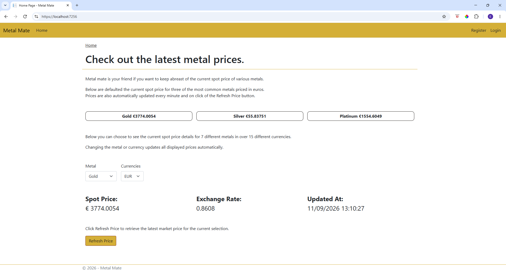
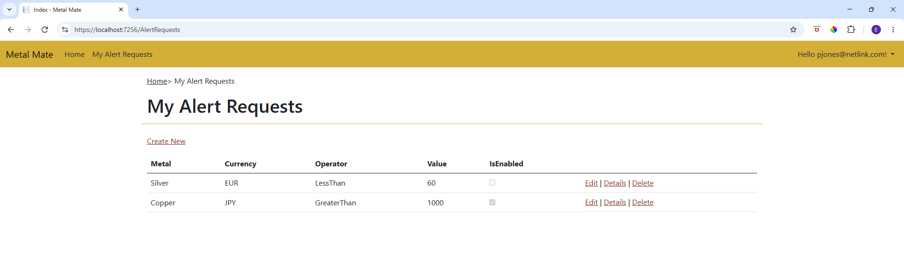
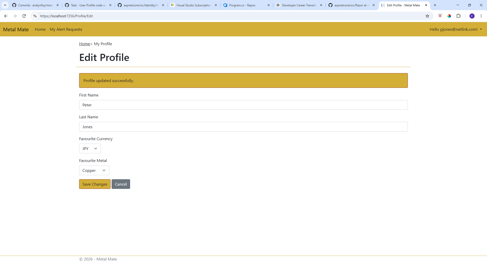
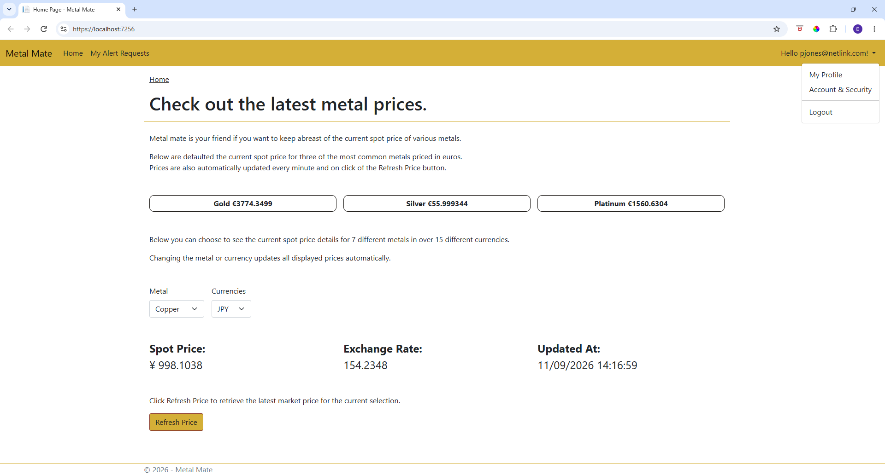
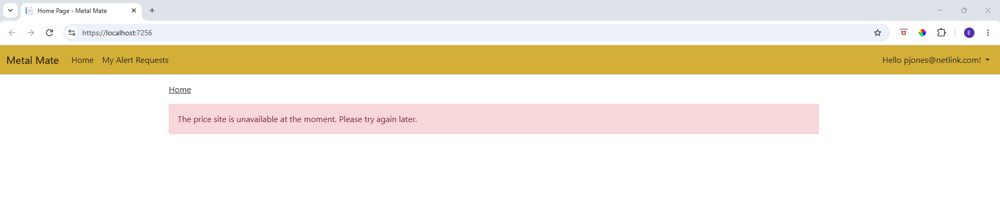
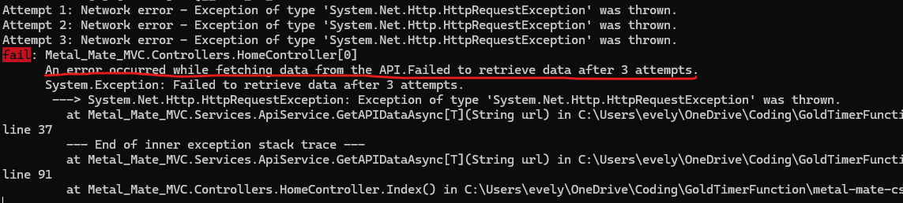
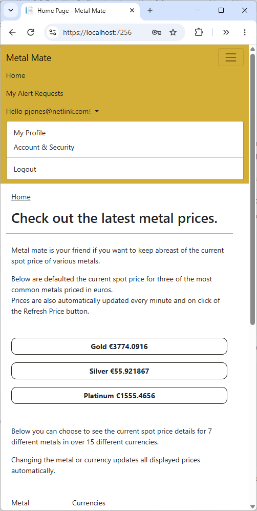
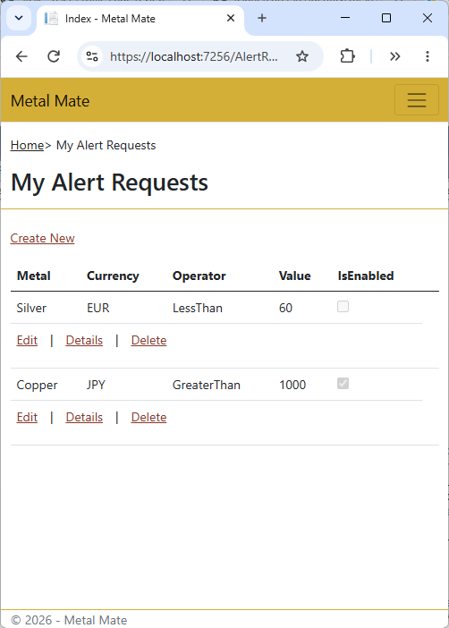

# Metal Mate
Metal Mate is an ASP.NET Core MVC web application that retrieves current precious metal prices from an external API and displays them on the home page.

Gold, silver and platimum prices are displayed by default in euros and a dropdown menu is provided allowing visitors to display the price of any metal/currency listed.  

Visitors can register with the application to set a currency/metal combination which then defaults on the home page.

Authenticated users can also create alert requests which will be processed by an Azure Timer Function and send out emails 
if the current price meets the specifications of the request.



## Features
* Displays current gold, silver and platinum prices in euros
* Provides dropdown lists for users own selections
* Prices automatically updated on change of selection
* Prices refreshed every minute using JavaScript
* Refresh button also provided to refresh prices
* Microsoft ASP.NET Core Identity authentication
* User profile for authenticated users to set a preferred metal/currency preferences
* Create, view, edit and delete personal price alerts
* User-specific data protection to ensure users can only access their own alerts
* External REST API integration
* Transient API error retry handling
* Input validation
* Exception handling and logging
* Responsive user interface
* Comprehensive unit and integration testing
* Azure Timer Function for processing price alerts and sending email notifications

## Example Alert
A user can create an alert such as:

> Send me an alert if the gold price in EUR is less than 3,500.

or:

> Send me an alert if the silver price in USD is greater than $60.



The Azure Timer Function periodically evaluates enabled alert requests against current metal prices and sends an email when the configured condition is met.

## Technology

* **C#**
* **ASP.NET Core MVC**
* **ASP.NET Core Identity**
* **Entity Framework Core**
* **SQL Server**
* **JavaScript**
* **REST API**
* **Azure Functions**
* **xUnit**
* **Moq**
* **Integration testing**
* **Git / Github**
* **ChatGPT / Copilot**

## External API Integration

Metal prices are retrieved from [Gold-API](https://www.gold-api.com/).

The application uses the API to retrieve current prices and available metals. API communication is handled asynchronously and includes exception handling and transient error retry logic.

The API integration is abstracted behind a service so that it can be mocked during unit and integration testing.

## User Authentication and Profile

Authentication is implemented using ASP.NET Core Identity.

Authenticated users can access their profile and configure:

* Favourite metal
* Favourite currency

These preferences are used to initialise the metal and currency selections on the home page.




User-specific alert requests are associated with the authenticated user's Identity ID. This ensures that users can only view and manage their own alerts.


## Alert Processing

Alert requests consist of:

* Metal
* Currency
* Comparison operator
* Target value
* IsEnabled

For example:

```text
Metal:     Gold
Currency:  EUR
Operator:  <
Value:     3500
Enabled:   true
```

An Azure Timer Function is used to periodically process the alert requests.
This functionality is currently under construction.

The function:

1. Retrieves active alert requests.
2. Retrieves current metal prices.
3. Evaluates each alert condition.
4. Sends an email when the configured condition is satisfied.
5. Disables the alert once an email has been sent.

The alert processing functionality is being developed separately from the MVC application to allow the scheduled processing to run independently.

## Architecture

The application separates presentation, application logic and data access responsibilities.

```text
                    
                            ┌──────────────┐        
                            |    Browser   |
                            └──────┬───────┘
                                   ▼
                           ┌─────────────────────┐
                           |   ASP.NET Core MVC  |
                           |      Controllers    |
                           └───────┬─────────────┘
                                   ▼
         ┌────────────────┐  ┌────────────────┐  ┌────────────────┐               
         | External API   |─►|   Services     |◄─|    Identity    |
         └────────────────┘  └──────┬─────────┘  └────────────────┘   
                                    ▼
                              ┌─────────────┐
                              │ SQL Server  │
                              └─────────────┘
                                    ▲
                                    |
                          ┌─────────┴───────────┐
                          │ Azure Timer Function│
                          └─────────┬───────────┘
                                    │
                                    ▼
                              Email Alerts

```

## Testing
The project contains both unit and integration tests.

### Unit Tests

Unit tests use xUnit and Moq to test application behaviour in isolation.

Testing includes:

* API service behaviour 
* Successful and failed API responses
* Retry behaviour for transient failures
* User profile functionality
* Controller actions
* Validation
* Alert request functionality
* Database service interactions

### Integration Tests

Integration tests use a custom `WebApplicationFactory` to exercise the application with its dependencies configured for testing.

The integration test environment includes:

* An in-memory SQLite database
* A configured test user manager
* A mocked metal price API service
* A mocked symbols list API service
* A mocked alert request database service
* A mocked dropdown population service
* Test responses for metal and currency data

This allows application components to be tested together without relying on the production database or external API.

The complete test suite can be run from Visual Studio using **Test Explorer → Run All Tests**.

## Error Handling and Logging

The application includes exception handling and logging to assist with diagnosing failures.

External API failures are handled explicitly, with transient failures retried before the final exception is returned.





## Responsive Design

The application uses responsive styling to provide a usable experience across a range of screen sizes.





## Running the Application

### Prerequisites

* Visual Studio
* .NET SDK
* SQL Server

### Configuration

The database connection string need to be configured through local configuration.
Also the base address of the API.

Secrets are not stored in the repository but the appsetting.json file should look like this.
```text
{
  "ConnectionStrings": {
    "DefaultConnection": "Server=(localdb)\\mssqllocaldb;Database=xxxxx;Trusted_Connection=True;MultipleActiveResultSets=true"
  },
  "Logging": {
    "LogLevel": {
      "Default": "Information",
      "Microsoft.AspNetCore": "Warning"
    }
  },
  "AllowedHosts": "*",
  "HttpClients": {
    "GoldApi": {
      "BaseAddress": "https://api.gold-api.com/"
    }
  }
}
```

### Running

1. Clone the repository.
2. Configure the required application settings.
3. Create/update the database using Entity Framework Core migrations.
4. Build and run the application from Visual Studio.
5. Run the test suite using Test Explorer.

## Future Development

* Complete and deploy the Azure Timer Function.
* Implement email delivery and alert processing.
* Look into adding automated CI/CD deployment.
* Further enhance monitoring and application diagnostics.
* Look into adding email confirmation for manage your account functionality.

